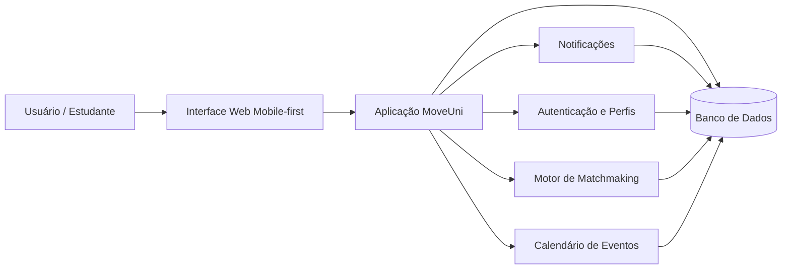
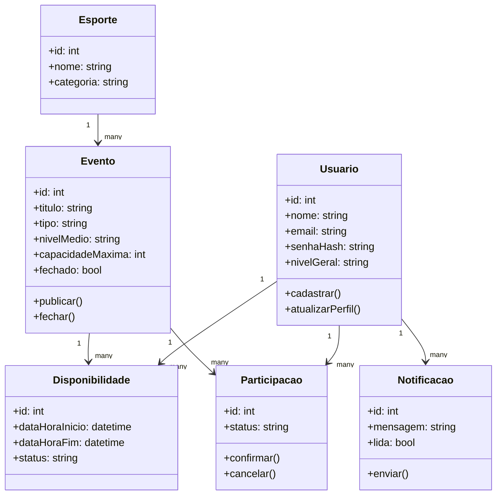
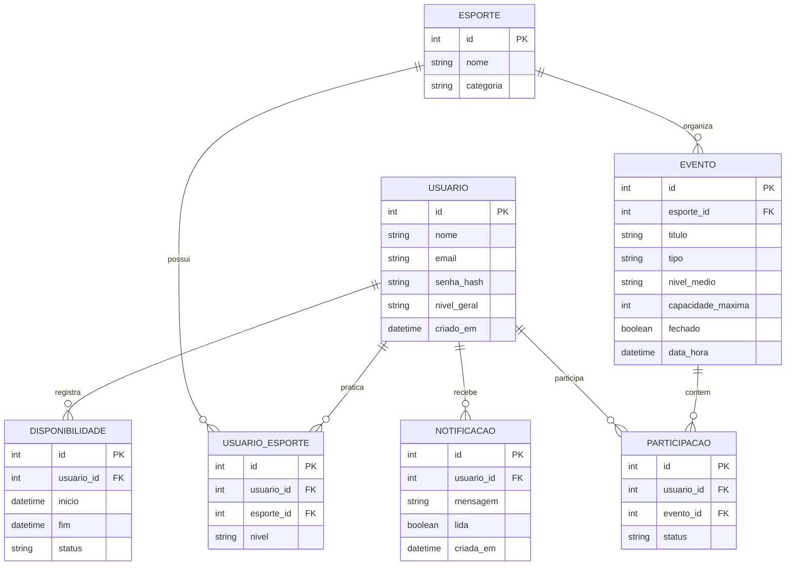

## **Documento de Arquitetura de Software**

**Histórico de Revisão**

|Data|Versão|Descrição|Autor|
| - | - | - | - |
|01/09/2026|0.1|Versão inicial preenchida com a arquitetura do projeto MoveUni|Gabriel Mendonça e Timóteo Stifft|

## **1. Introdução**

### **1.1 Finalidade**
Este documento apresenta a arquitetura de software do **MoveUni**, um aplicativo voltado para estudantes universitários que desejam encontrar colegas para praticar esportes e organizar partidas ou grupos de atividade física. O objetivo é registrar as decisões arquiteturais, o estilo de organização do sistema, suas restrições técnicas e a forma como o código e os dados são estruturados.

### **1.2 Escopo**
O escopo deste documento abrange a visão arquitetural da solução como um todo, incluindo organização lógica, restrições de tecnologia, visão de dados, tamanho esperado e atributos de qualidade.

### **1.3 Definições, Acrônimos e Abreviações**

|Abreviação|Definição|
| - | - |
|API|Interface de Programação de Aplicações|
|CRUD|Create, Read, Update, Delete|
|DER|Diagrama de Entidade-Relacionamento|
|DLD|Diagrama Lógico de Dados|
|MVC|Model-View-Controller|
|RNF|Requisito Não Funcional|
|RF|Requisito Funcional|

### **1.4 Visão Geral**
Este documento está organizado em seis partes principais: a representação da arquitetura adotada, as metas e restrições arquiteturais, a visão lógica do sistema, a visão de implementação, considerações de tamanho e desempenho, atributos de qualidade e referências. A documentação foi elaborada com base no propósito do projeto MoveUni e nos requisitos já levantados para o aplicativo.

## **2. Representação da Arquitetura**

O MoveUni adota uma **arquitetura cliente-servidor em monólito modular**, ideal para um aplicativo acadêmico de evolução gradual. Essa escolha simplifica o desenvolvimento, facilita a documentação e reduz a complexidade operacional, ao mesmo tempo em que permite separar bem as responsabilidades internas do sistema.

Na prática, o sistema é pensado como uma aplicação web/mobile-first consumida por navegadores, com uma camada de apresentação, uma camada de regras de negócio e uma camada de persistência de dados. Essa estrutura é suficiente para lidar com funcionalidades como cadastro, disponibilidade, matchmaking, calendário e notificações.

### **2.1 Diagrama de Relações**



## **3. Metas e Restrições de Arquitetura**

|**Restrição**|**Ferramenta**|
| :- | :- |
|Linguagem|Python no backend e HTML/CSS/Markdown para a documentação; JavaScript pode ser utilizado na interface, se necessário|
|Framework|MkDocs Material para a documentação; a aplicação pode ser estruturada com Flask ou FastAPI em uma futura implementação|
|Plataforma|Web, com foco mobile-first|
|Segurança|Autenticação com senha criptografada, controle de acesso por usuário e proteção de dados pessoais|
|Idioma|Português (pt-BR)|

## **4. Visão Lógica**

### **4.1 Visão geral: Pacotes e Camadas**
A solução é organizada segundo uma variação do padrão **MVC**:

- **View**: responsável pela interface do usuário, telas de cadastro, agenda, partidas e perfil.
- **Controller**: concentra o fluxo de interação, recebendo ações do usuário e coordenando as respostas da aplicação.
- **Model**: representa as entidades de domínio, como usuário, esporte, disponibilidade, evento e nível de habilidade.
- **Service/Use Cases**: camada intermediária que contém regras como agrupamento automático, priorização de atividades e confirmação de partidas.
- **Repository/Persistence**: camada responsável pelo acesso ao banco de dados e armazenamento dos registros.

### **4.2 Organização do Código**
Como o repositório atual é focado na documentação, a organização lógica do projeto pode ser entendida da seguinte forma:

- `docs/`: documentos formais do projeto, incluindo requisitos, arquitetura e identidade visual.
- `docs/stylesheets/`: estilos visuais da documentação publicada com MkDocs.
- `.github/workflows/`: automações de publicação e entrega da documentação.
- `README.md`: visão geral do projeto e informações da equipe.
- `CONTRIBUTING.md`: regras de contribuição, branches e commits.
- `mkdocs.yml`: configuração da navegação, tema e publicação da documentação.

O aplicativo possui a seguinte estrutura:

- `src/` ou `app/`: código-fonte principal da aplicação.
- `app/models/`: entidades e regras de domínio.
- `app/services/`: regras de negócio e casos de uso.
- `app/controllers/`: endpoints ou controladores da aplicação.
- `app/templates/` ou `app/views/`: interface da aplicação.
- `app/repositories/`: acesso a dados.
- `tests/`: testes automatizados.

### **4.3 Diagrama de Classes**



## **5. Visão de Implementação**

### **5.1 Diagrama de Entidade-Relacionamento**



### **5.2 Diagrama Lógico de Dados**

```mermaid
flowchart TB
    USUARIO[USUARIO\n(id, nome, email, senha_hash, nivel_geral)]
    ESPORTE[ESPORTE\n(id, nome, categoria)]
    USUARIO_ESPORTE[USUARIO_ESPORTE\n(id, usuario_id, esporte_id, nivel)]
    DISPONIBILIDADE[DISPONIBILIDADE\n(id, usuario_id, inicio, fim, status)]
    EVENTO[EVENTO\n(id, esporte_id, titulo, tipo, nivel_medio, capacidade_maxima, fechado, data_hora)]
    PARTICIPACAO[PARTICIPACAO\n(id, usuario_id, evento_id, status)]
    NOTIFICACAO[NOTIFICACAO\n(id, usuario_id, mensagem, lida, criada_em)]

    USUARIO --> USUARIO_ESPORTE
    ESPORTE --> USUARIO_ESPORTE
    USUARIO --> DISPONIBILIDADE
    ESPORTE --> EVENTO
    EVENTO --> PARTICIPACAO
    USUARIO --> PARTICIPACAO
    USUARIO --> NOTIFICACAO
```

## **6. Tamanho e Desempenho**

O MoveUni é pensado para uma comunidade universitária de pequeno a médio porte, com alguns milhares de usuários cadastrados e picos de acesso em horários de intervalo e no fim da tarde. O volume de dados esperado é moderado: cadastros de usuários, preferências esportivas, disponibilidades semanais e eventos com histórico de participação.

Para esse cenário, uma arquitetura monolítica com banco relacional é suficiente e vantajosa. Índices em campos como `email`, `esporte_id`, `data_hora` e `status` ajudam no desempenho das buscas e do matchmaking. A aplicação deve responder rapidamente às ações do usuário, especialmente na criação de disponibilidades e na sugestão de partidas.

## **7. Qualidade**

A arquitetura proposta favorece os seguintes atributos de qualidade:

- **Manutenibilidade**: a separação em camadas facilita localizar regras de negócio e evoluir funcionalidades.
- **Testabilidade**: regras como agrupamento automático e cálculo de nível médio podem ser testadas isoladamente.
- **Escalabilidade**: embora monolítica, a divisão interna por módulos permite crescer sem reescrever todo o sistema.
- **Segurança**: autenticação, senha criptografada e controle de acesso reduzem riscos de uso indevido.
- **Usabilidade**: o foco mobile-first atende ao contexto de uso pelos estudantes.
- **Consistência**: o uso de um único modelo de dados central evita divergências entre telas e registros.

## **8. Referências**

- Documento de Requisitos do projeto MoveUni.
- README.md do repositório `MagiMahou/construcao-2026.2-t1`.
- CONTRIBUTING.md do repositório.
- MkDocs Material: documentação oficial do framework de publicação.
- Convenções de documentação da disciplina de Construção de Software.
